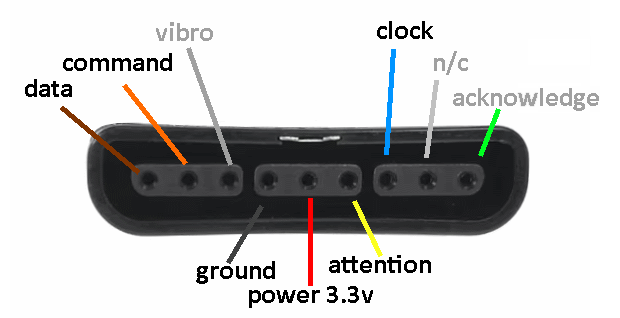

# micropython_ps2_controller
Library for PS1/PS2 controllers (joysticks).

Here is a good explanation of how the PS2 controller works: https://store.curiousinventor.com/guides/PS2/

# Pinout


# Code example:
```python
from ps2_controller import PS2_Controller
from time import sleep_ms

PS2_DATA = 19 # Data
PS2_CMD  = 23 # Command
PS2_ATT  = 5  # Attention
PS2_CLK  = 18 # Clock

controller = PS2_Controller( PS2_DATA, PS2_CMD, PS2_ATT, PS2_CLK )

middle_pos = ( 127, 128 )
while True:
    keys = controller.read_keys()
    
    if len(keys) > 5 or any( k not in middle_pos for k in keys[1:5] ):
        print(keys)
    sleep_ms(20)
```
# Function description
**read_keys( self )** - return 5-21 values of data:
* value 0 ( bool ) - Analog mode On/Off
* value 1 ( int ) - Right joystick, X axis
* value 2 ( int ) - Right joystick, Y axis
* value 3 ( int ) - Left joystick, X axis
* value 4 ( int ) - Left joystick, Y axis
* value 5..21 ( string ) - Pressed buttons: SELECT, L3, R3, START, UP, RIGHT, DOWN, LEFT, L2, R2, L1, R1, TRIANGLE, O, X, SQUARE
